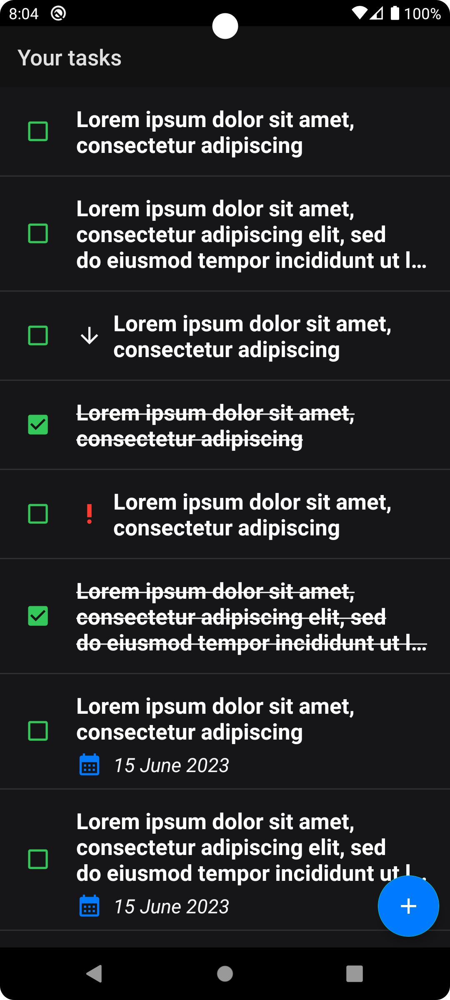
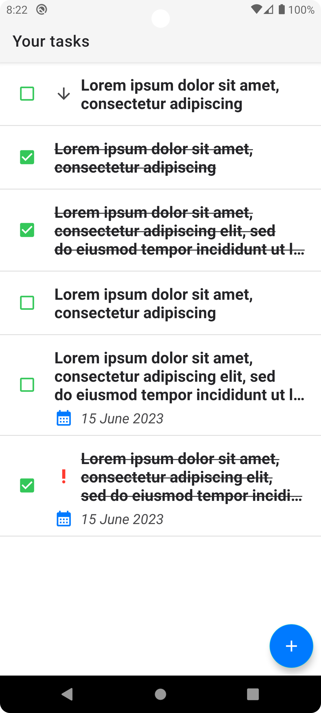
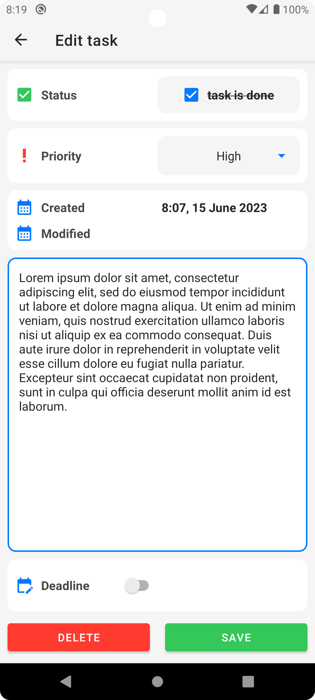
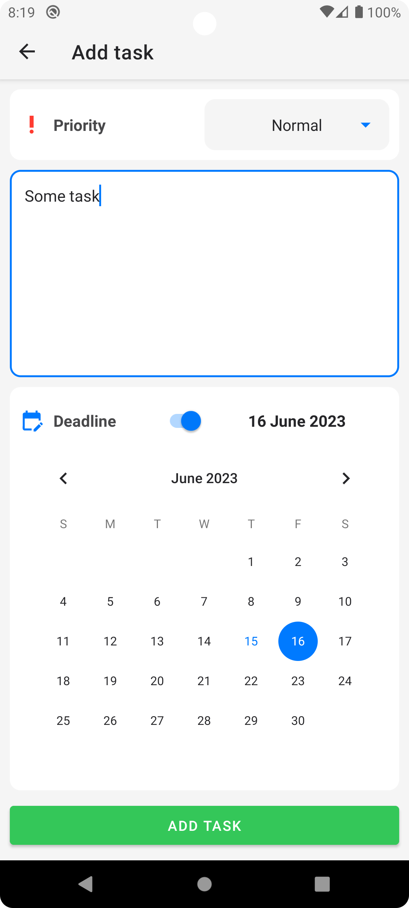

# Yandex ToDo Application
### Made by [Mikhail Babushkin](https://github.com/AlexCawl)

## Project *killer-features*
- Swiping both left & right
    - Swiping **left** to delete. Item will be removed from Recycler View. Trash icon will be drawn at the red background while swiping.
    - Swiping **right** to check. Item **isDone** param will be inverted & item will be recreated by the RecyclerView. Check box icon will be drawn at the green background while swiping.
- Drag & drop items behaviour in RecyclerView. User can change tasks order.
- Both **Day** and **Night** Themes supported
- **Responsive UI**
    - CalendarView is shown depending on the status of the deadline Switch. Scaling of other UI components is done automatically.
    - Text becomes strikethrough when the task is completed and vice versa
    - Fragment navigation implemented

## Homework [1] ✅
В моей реализации есть пара особенностей.
1. Дизайн не как на Figma. Но это нормально, Figma нужна была только для вдохновения)
2. Service package сделана по факту для мока данных. Пока LiveData лежит в VM. Но я это исправлю как подключу ROOM.
3. Навигация переживает поворот экрана, но данные во фрагменты нет. Вернее переживают, но не все. Тоже пофикшу при подключении ROOM.
4. TodoItemsRepository сделан для мока данных! Реализован как singleton. Но пока только мокает данные! Данные добавляются, recycler view перерисовывает, все классно, но LiveData живет в ViewModel. Просто поэкспериментировал с observable list в LiveData с помощью extensions. Поэтому и не вызывается метод в ItemsTodoRepository :)

## Screenshots

